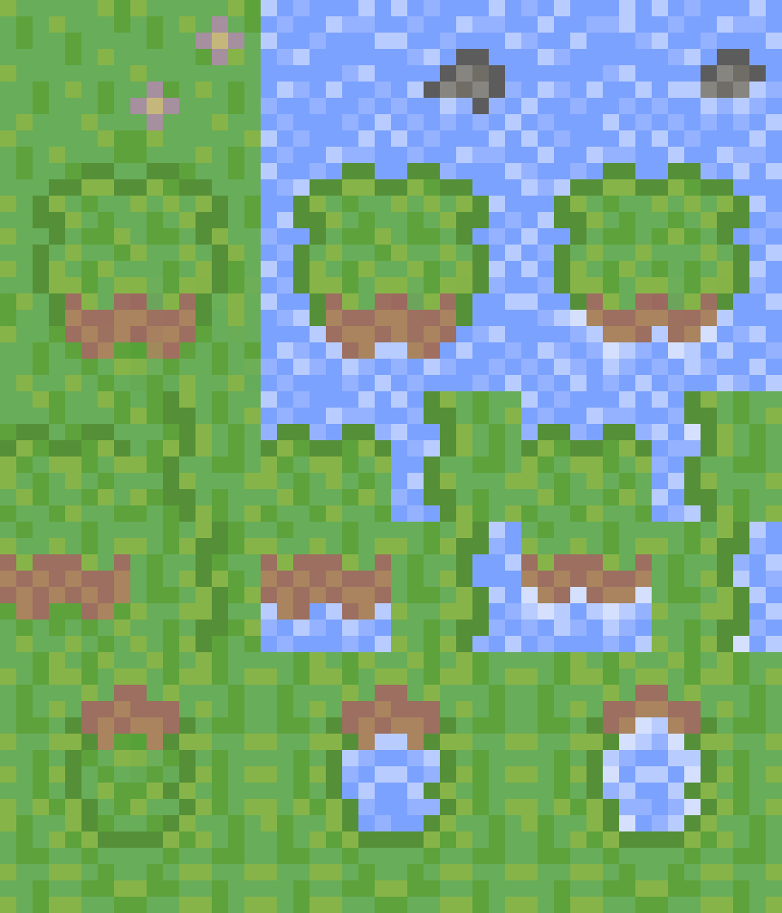
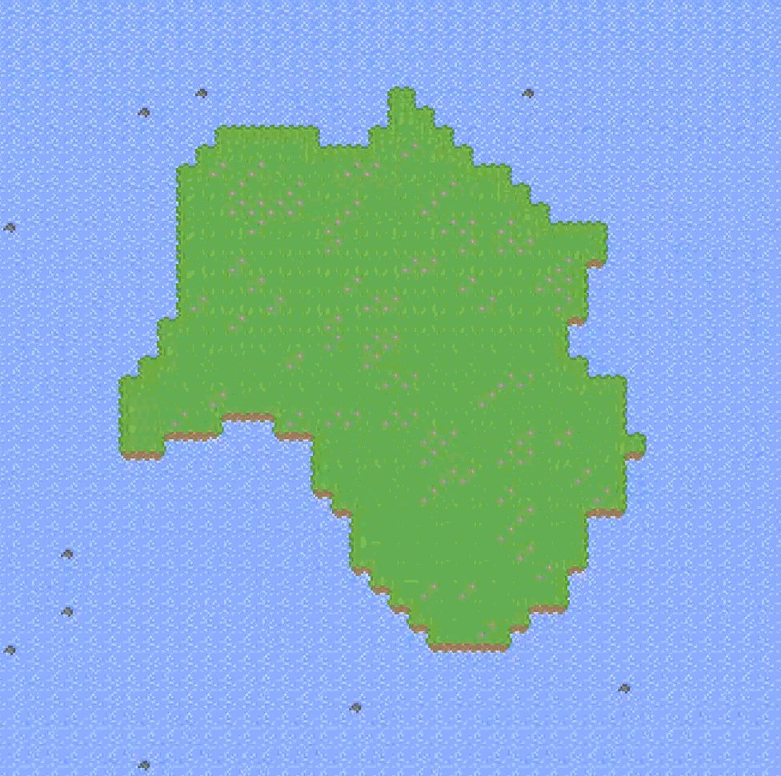

# Mayor-Simulation-Game
**Links** : [Executable File](https://drive.google.com/drive/folders/1VgnvR0E7NHgitLWCWsU2q8_cvIIBwomG?usp=drive_link)

## **Step 1** - Terrain Generation
<table>
    <tr>
        <td>
            When you start a new game, a custom island will be created for you to begin building your town upon. This island is created through a combination of procedural texture generation, a radial texture mask, and a custom smoothing algorithm.
              
            The initial texture is created using a built-in Simplex noise algorithm from the Godot Engine. The resultant noise texture is then multiply blended with a circular gradient mask texture. Finally, a smoothing algorithm checks each tile to make sure it has a matching tile in the terrain atlas. 
        </td>
        <td>
            <figure>
                
                <figcaption>Terrain Atlas</figcaption>
            </figure>
        </td>
        <td>
            <figure>
                
                <figcaption>Example Island</figcaption>
            </figure>
        </td>
    </tr>
</table>

